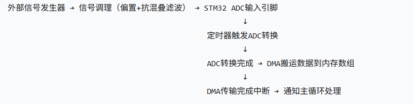

## 一.ADC定时器触发 + DMA采样
### 1.整体信号流
>
>
>>1.1 信号发生器输出
典型输出：正弦波、方波、三角波、AM/FM波，频率 1k~100kHz，峰峰值 1.5V，以0V为中心（范围 -0.75V ~ +0.75V）。
问题：STM32 ADC只能测量 0V ~ 3.3V 的正电压，不能测负电压。//==才要用到偏置电路==
>***
>>1.2 偏置电路
作用：给信号叠加一个直流偏置电压（1.65V），将整个波形抬高到 0.9V ~ 2.4V 范围内。//低电平和高电平
常用电路：运放构成的加法器，或者电阻分压+电容耦合。最简单的：两个等值电阻分压得到1.65V，再通过一个电阻与输入信号叠加，送入运放跟随。
结果：信号变为单极性，适合ADC输入。
//双极性是有正有负的，单极性只有正的。
>>>https://blog.csdn.net/qq_57427700/article/details/146079769?ops_request_misc=elastic_search_misc&request_id=d43a0e62b33ff48345141202ad0c49ae&biz_id=0&utm_medium=distribute.pc_search_result.none-task-blog-2~all~top_positive~default-1-146079769-null-null.142^v102^pc_search_result_base8&utm_term=%E5%81%8F%E7%BD%AE%E7%94%B5%E8%B7%AF&spm=1018.2226.3001.4187
>***
>>1.3 抗混叠滤波
作用：滤除高于采样率一半的频率成分，防止这些高频信号混叠到低频段（假频）。
简单实现：一阶RC低通滤波器，截止频率略低于采样率/2（例如采样率250kHz，截止频率设为100kHz~120kHz）。
**/ * 一阶RC
最简单：一个电阻R和一个电容C串联，
电容两端接到 ADC 输入和地。*/**
信号从电阻输入端进入，从电容两端输出到 ADC 引脚。
参数：R=1kΩ，C=1.2nF（截止频率≈132kHz），实际可根据信号微调。
>***
>>1.4 最终输入到ADC引脚
电压范围：0~3.3V，信号已偏置且滤波，可直接连接STM32的ADC输入引脚（如PA0）。
### 2.TIM定时器触发+DMA采样