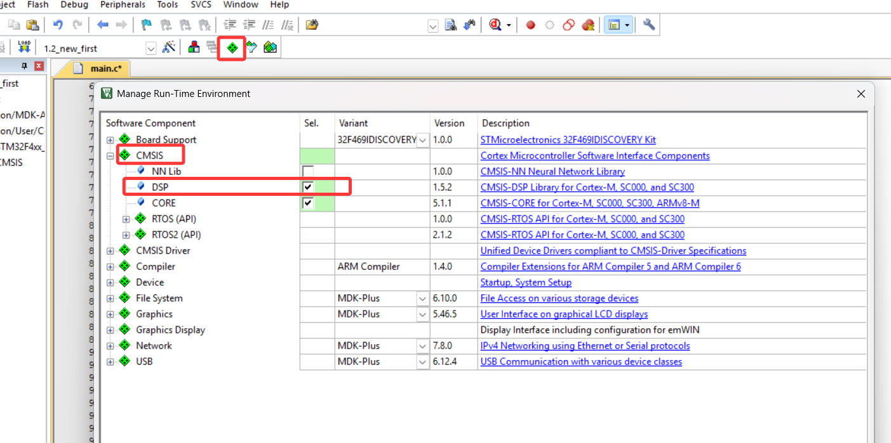

### 1.DSP的安装

### 2.开启硬件 FPU
>1.点击 "Options for Target"（魔法棒图标）。
>2.在 C/C++ 选项卡 → "Preprocessor Symbols" → "Define" 中添加==ARM_MATH_CM4==
>
>ARM_MATH_CM4,ARM_MATH_MATRIX_CHECK,ARM_MATH_ROUNDING
>>如果是 F1 系列用 ARM_MATH_CM3，F4 用 ARM_MATH_CM4，H7 用 ARM_MATH_CM7。

>3.同样在 C/C++ 选项卡 → "Include Paths" 中添加：
>..\Drivers\CMSIS\DSP\Include
>>如果不确定路径，可以用 Windows 搜索 arm_math.h 找到它所在的文件夹。
