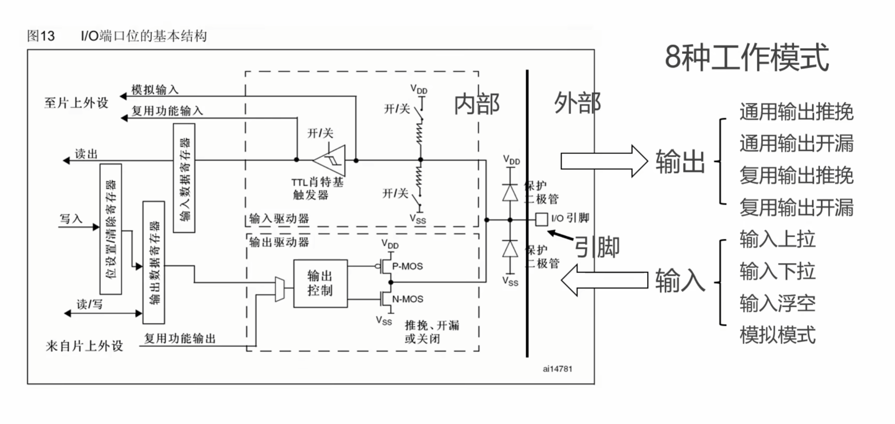
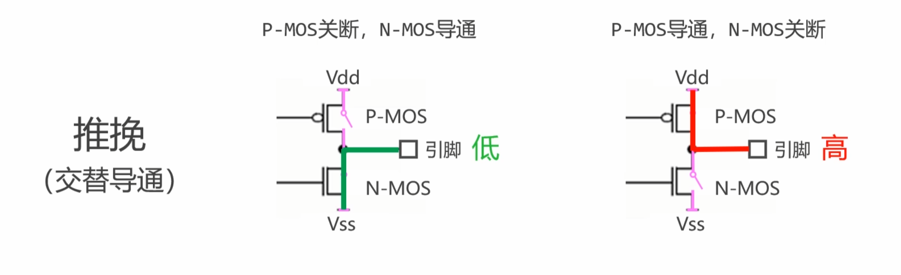
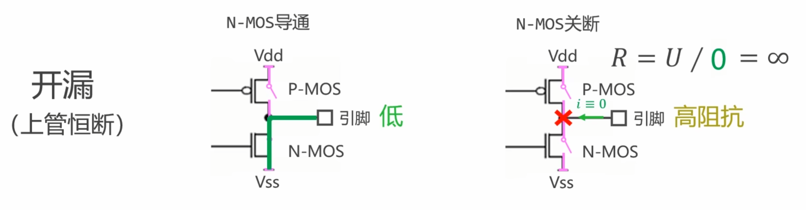
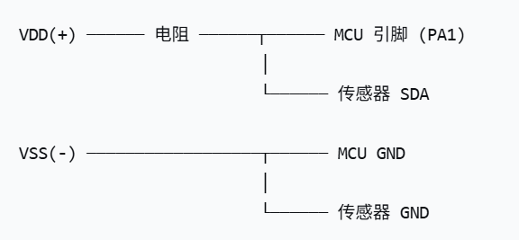
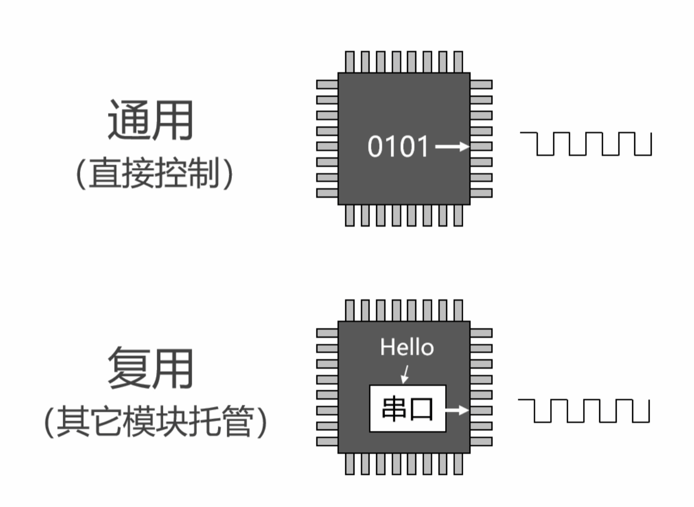
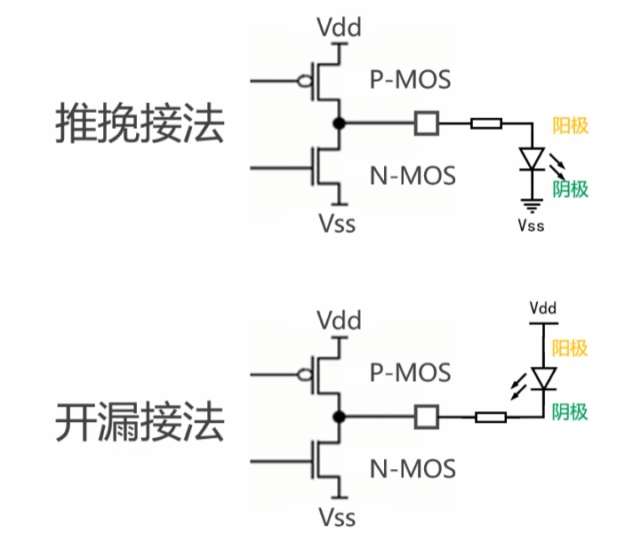
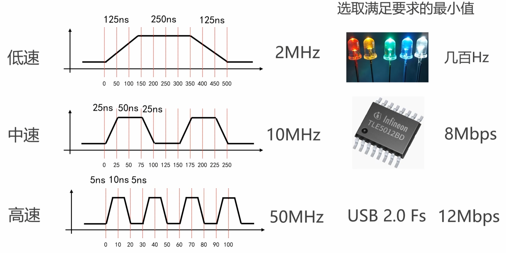
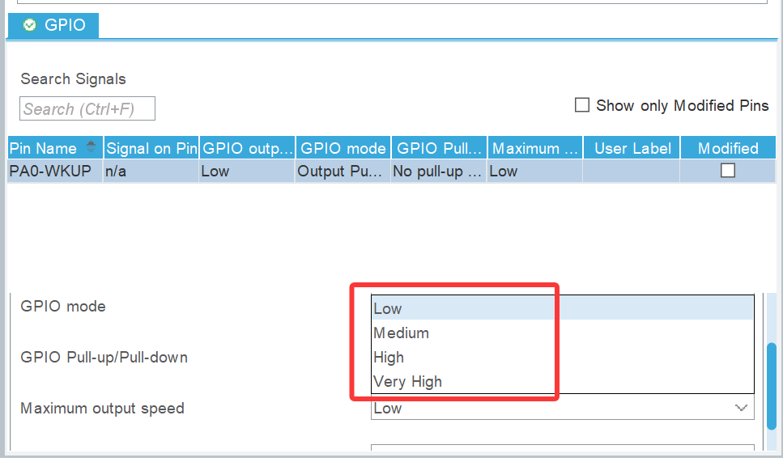
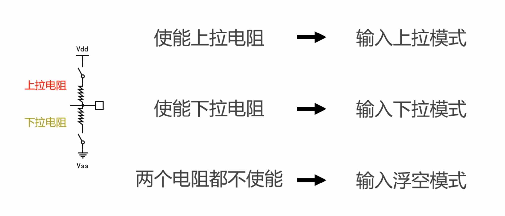
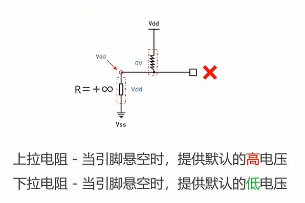

## 四种输出模式

#### 1.推挽
>P-MOS和N-MOS中间可以看成开关

>输入0输出低电平，输入1输出高电平
#### 2.开漏//无源
>P-MOS一直保持断开

>电压用外接的电压源决定
>
>MCU就是单片机，通用开漏用于模拟“非标准”通信协议，提高电压。不共地数值就不一定一致（同一个“海拔零点”）
#### 3.通用和复用
>
>**vdd连接vss,所以出现了一上一下，其实是接线方式**
#### 4.简单应用
>需要自己去GPIO设置模式

## 低/中/高速

## 四种输入模式
#### 1.上拉和下拉和浮空
>
>输入模式下相当于一块电压表，其内阻∞大。

>如果引脚悬空，什么都没接，脚就像天线，会感应周围的 50Hz 交流电、电磁干扰等，电平在 0 和 1 之间疯狂跳动