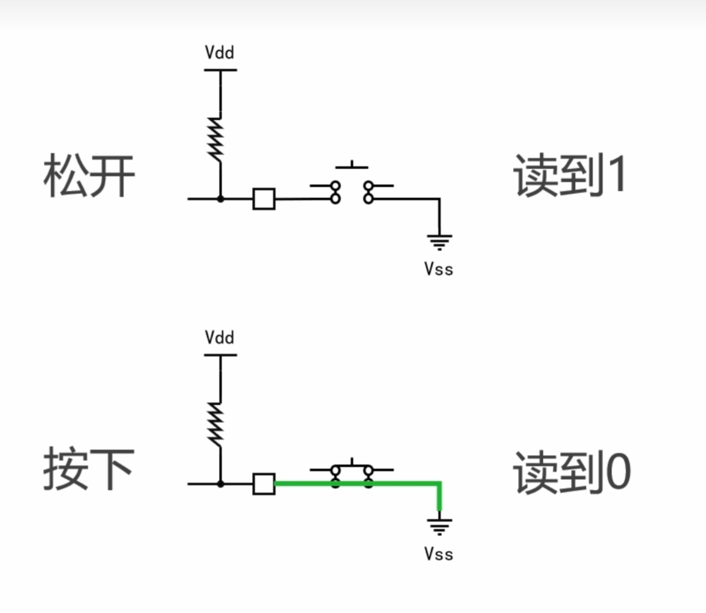

## 简单的按键控制

>这里引脚上拉电阻了，所以初始是1，是MCU的Vdd。按下后，连接到Vss,变为低电平。
```c
/*              常用的函数 
HAL_GPIO_ReadPin，读取当前OI的值
GPIO_inState HAL_GPIO_ReadPin(GPIOX, GPIO_PIN);*/
//所以可以写出
    if(HAL_GPIO_ReadPin(GPIOA, GPIO_PIN_0)==GPIO_PIN_RESET)
{
    HAL_GPIO_WritePin(GPIOA, GPIO_PIN_1, GPIO_PIN_SET);//PA0控制PA1的电平
}
    else
    {
        HAL_GPIO_WritePin(GPIOA, GPIO_PIN_1, GPIO_PIN_RESET);
    }
```
