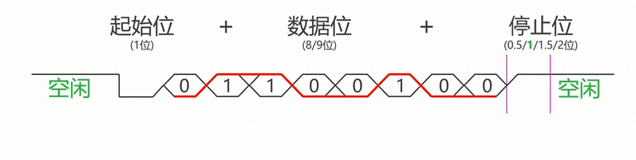
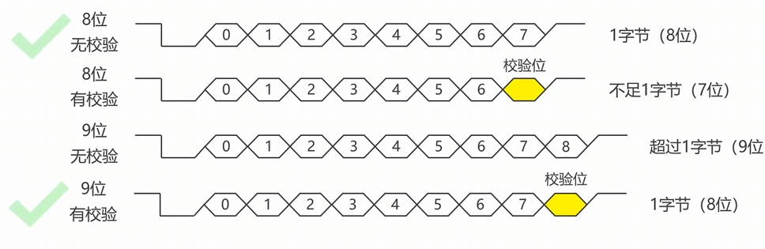
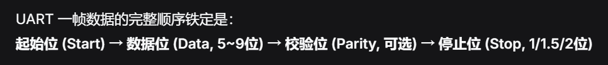

## 串口数据收发格式

>如输出100的信号，转化成二进制就是00100110，颠倒过来就是01100100，0底1高就得到红线了。//通常发送一个字节（8位）
>前提是波特率一致
>起始位会由高到低，会在0.5位（中间位置）进行判断（是不是低电平）
>停止位的设计是数据位走完后，会等待一个停止位，然后进行判断，如果接收到高电平，则接收成功，如果接收到低电平，则接收失败。恢复到高电平为下一次做准备。

>           **校验位：**
>
>接收方端收到数据后，会进行校验，如果奇偶正确，则接收成功，如果错误，则接收失败。
>首先判断校验位是否正确（奇偶校验验证）；
若正确，去掉校验位，保留数据位。//错误则丢弃整个数据。

