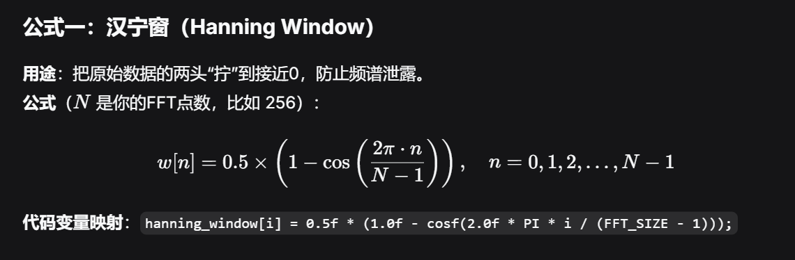
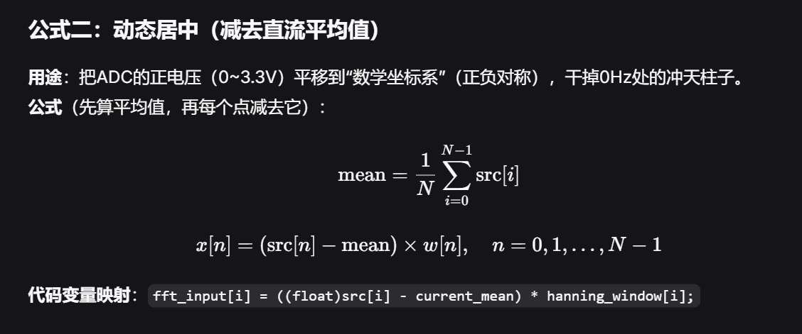
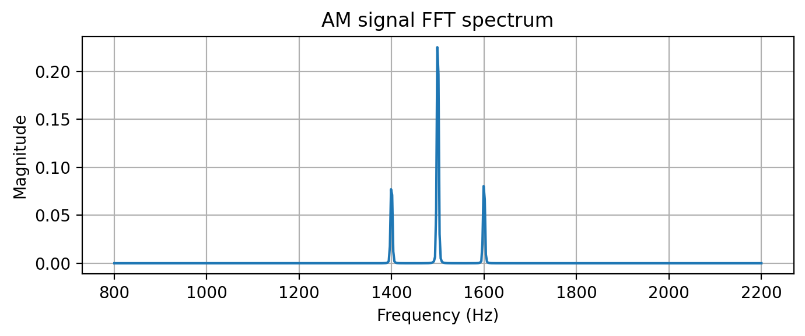
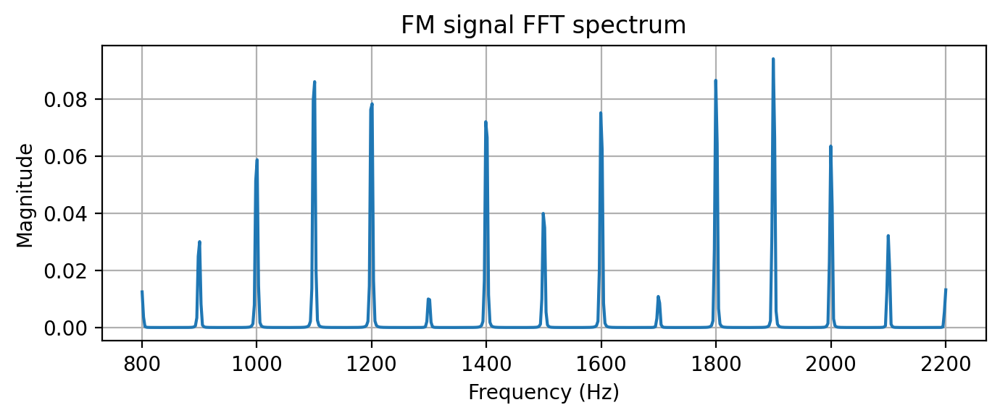

### FFT

```c
// --------------------------------------------------
// 子函数1: 初始化窗函数 (在main函数开始时调用一次)
// --------------------------------------------------
void Init_Window(void) {
    for (int i = 0; i < FFT_SIZE; i++) {
        // 汉宁窗公式: 0.5 * (1 - cos(2πi / (N-1)))
        hanning_window[i] = 0.5f * (1.0f - cosf(2.0f * PI * i / (FFT_SIZE - 1)));
    }
}
```

```c
// --------------------------------------------------
// 子函数2: FFT核心处理流水线 (Process_FFT_Data)
// --------------------------------------------------
void Process_FFT_Data(uint16_t *src) {
    /* ========== 第1步：预处理（居中 + 加窗） ========== */
    // 1.1 计算这256个点的实际平均值（动态计算，消除硬件偏置误差）
    uint32_t sum = 0;
    for (int i = 0; i < FFT_SIZE; i++) {
        sum += src[i];
    }
    float current_mean = (float)sum / FFT_SIZE; // 比如算出来是 2050.5
    
    // 1.2 数据居中（减去平均值）并乘上汉宁窗（消除频谱泄露）
    for (int i = 0; i < FFT_SIZE; i++) {
        // 减法: 产生正负交替的交流信号 (例如 3000 - 2050.5 = +949.5)
        // 乘法: 把首尾数据强制“拧”到接近0，去除ADC偏置，使信号围绕0轴摆动
        fft_input[i] = ((float)src[i] - current_mean) * hanning_window[i];
    }
```
```c
/* ========== 第3步：计算幅度谱（取模，并丢掉镜像） ========== */
    // 只取前 N/2 = 128 个点（后半部分是镜像，丢掉）
    // 从 i = 1 开始（跳过第0个直流分量，虽然减了均值，但防止残留直流干扰显示）
    for (int i = 1; i < FFT_SIZE / 2; i++) {
        float real = fft_output[2 * i];      // 实部
        float imag = fft_output[2 * i + 1];  // 虚部
        // sqrt(实部^2 + 虚部^2) = 幅度
        // arm_sqrt_f32 是STM32硬件加速的开方，比标准sqrtf快很多
        arm_sqrt_f32(real * real + imag * imag, &magnitude_spectrum[i - 1]);//&magnitude_spectrum[i - 1]储存频谱（结果）
    }
```
### 用FFT判断
##### 确认基波
```c
int find_fundamental(float *mag, int len) {
    int peak_index = 3; // 从第3个点开始，避开直流和极低频噪声
    float max_val = mag[3];
    for (int i = 4; i < len; i++) {
        if (mag[i] > max_val) {
            max_val = mag[i];
            peak_index = i;
        }
    }
    return peak_index; // 返回基波所在的数组下标
}
```


```c
// 前提：上面判断 ratio > 0.05 (说明不是正弦波)
float ratio_3rd = mag[peak_index * 3] / fundamental_mag;

if (ratio_3rd > 0.25) {
    return WAVE_SQUARE; // 接近1/3，判为方波
} else if (ratio_3rd > 0.08) {
    return WAVE_TRIANGLE; // 接近1/9，判为三角波
}

/* ========== 正弦波 ========== */
float fundamental_mag = mag[peak_index];
// 查看3次谐波位置（如果没超出频谱范围）
//数学判据：（3次谐波幅值） / （基波幅值） < 0.05
int idx_3rd = peak_index * 3;
if (idx_3rd < 128) {
    float ratio = mag[idx_3rd] / fundamental_mag;
    if (ratio < 0.05) {
        return WAVE_SINE; // 正弦波
    }
}
```
##### AM
在基波（载波）的两边，紧挨着有两根对称的小柱子

```c
// 假设AM调制频率较低，边带紧挨着载波
float left_side = mag[peak_index - 2];
float right_side = mag[peak_index + 2];

// 如果左右两边都有较大的边带（比如边带幅值 > 基波的 10%）
if (left_side > fundamental_mag * 0.1 && right_side > fundamental_mag * 0.1) {
    return WAVE_AM;
}
```
##### FM
如果在基波左右 ±4 ~ ±10 个点范围内，有连续多根柱子的幅值都超过了基波的 20%

```c
// 检查基波左右两侧是否出现“一群”柱子
int side_count = 0;
for (int i = peak_index - 6; i <= peak_index + 6; i++) {
    if (i > 0 && i < 128 && i != peak_index) {
        if (mag[i] > fundamental_mag * 0.15) {
            side_count++;
        }
    }
}
// 如果周围有超过 4 根能量较大的边带，判为 FM
if (side_count > 4) {
    return WAVE_FM;
}
```
