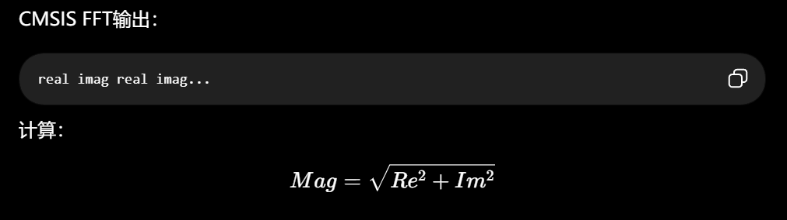
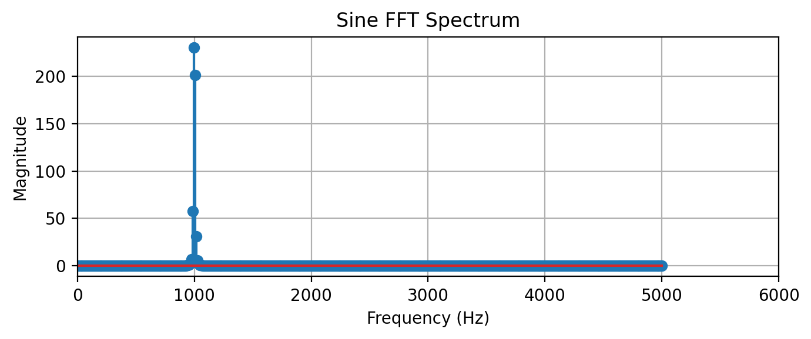
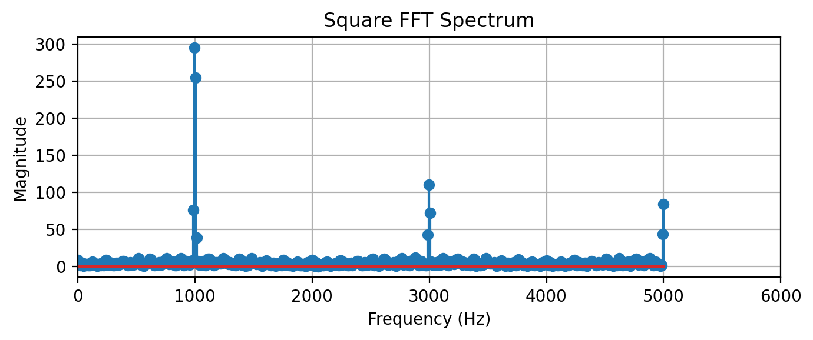
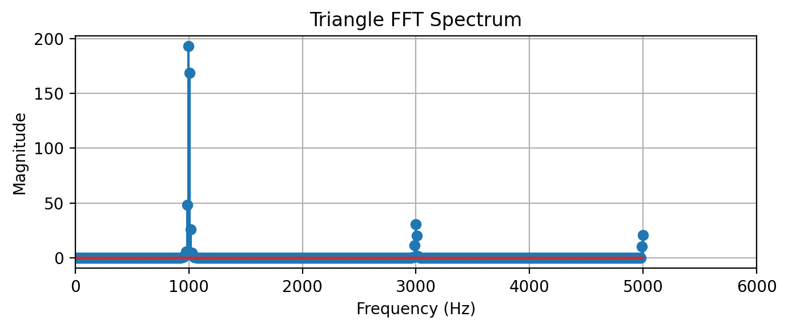

## 1.FFT的基础参数
```c
/*假如有*/
#define FFT_SIZE     256//决定精细度
#define SAMPLE_RATE  1028//ADC 每秒采集多少个数据点,这里ADC每秒采集1028个数据点  
```
#### Δf=Fs/N，所以Δf=1028/256=4HZ。fk​=kΔf
```c
float Get_Freq(int index)
{
    return index * SAMPLE_RATE / FFT_SIZE;//如果index=32,所以f=32*1028/256=4HZ，信号里一定有4Hz
}
```
## 2.FFT的幅值计算

>这就是镜像，偶实奇虚	​
```c
for(int i=0;i<FFT_SIZE/2;i++)
{
    float real=fft_output[2*i];
    float imag=fft_output[2*i+1];
    mag[i]=sqrt(real*real+imag*imag);
}
```
## 3.找最大峰（载波），基波（除去DC影响）
>除去0Hz（除去DC），DC是平均电压
```c
#define start 3//丢弃有区别的，建议问一下
int FindPeak(float *mag)
{
    int index=start;
    float max=mag[start];
    for(int i=start+1;i<FFT_SIZE/2;i++)
    {
        if(mag[i]>max)//到最大峰暂停
        {
            max=mag[i];
            index=i;
        }
    }
    return index;
}
```
## 正弦/方波/三角波/AM/PM
### 看谐波
比如基波1000，三次谐波为3000；基波为f0
ratio=mag[3*f0]/mag[f0]；//对应频域图的值，然后计算ratio
#### 正弦

A3​/A1​≈0
正弦的判断为ratio<0.05
```c
if(ratio<0.05)
{
    return WAVE_SINE;
}

```
#### 方波

只有奇次谐波：1f0​,3f0​,5f0​
An​=1/n;A3​/A1​=1/3
```c
if(ratio>0.2 &&
   ratio<0.45)
{
    return WAVE_SQUARE;
}
```
#### 三角波

An​=1/n*n;A3​/A1​=1/9
```c
if(ratio>0.05 &&
   ratio<0.18)
{
    return WAVE_TRIANGLE;
}
```
#### AM
特点：有中心峰，两侧对称，只有少量边带
//if(mag[carrier_bin-i] > mag[carrier_bin]*0.05)
**里面的 0.05 不是 FFT 的公式，而是一个人为设定的阈值。
如果旁边的频率峰值大于载波峰值的 5%，认为它是一个有效边带。**
```c
int left=0;right=0;
for(int i=1;i<FFT_SIZE/2;i++)
{
    if(mag[carrier_bin-i] > mag[carrier_bin]*0.05)
    {
        left++;
    }
    if(mag[carrier_bin+i] > mag[carrier_bin]*0.05)  
    {
        right++;
    }
}
if(left=right&&left<=3)//3对应超过阈值的bin数量
{
    return AM;
}
```