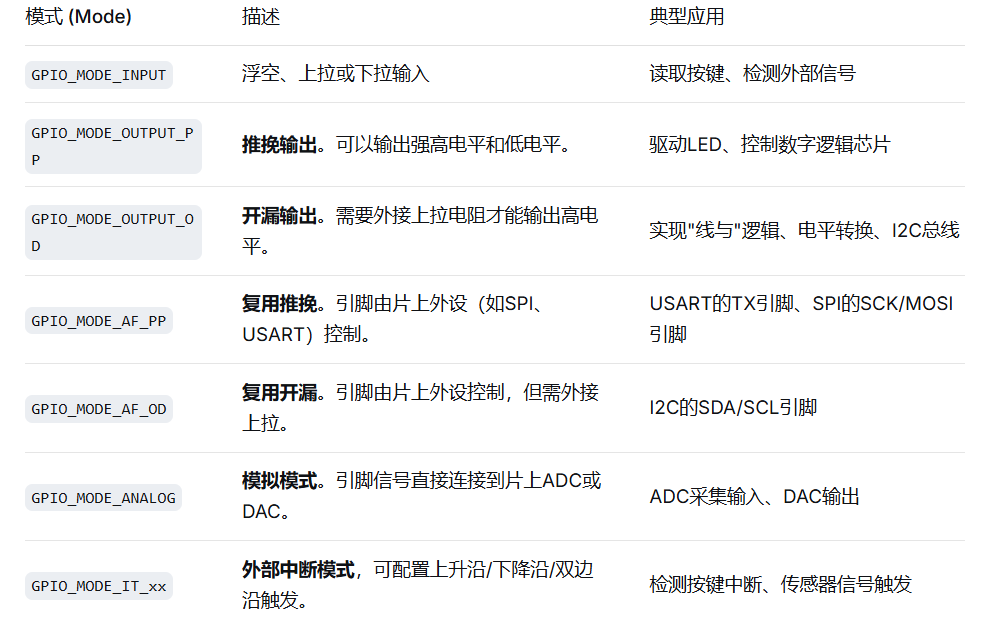
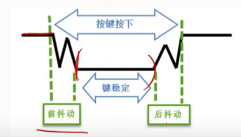
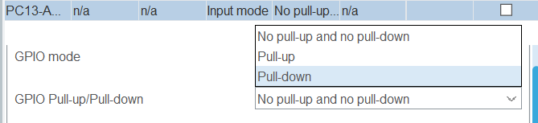
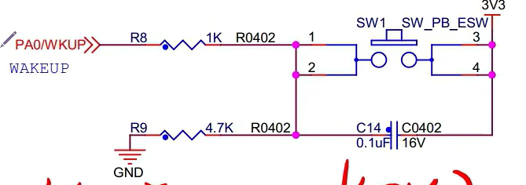

# GPIO
>1.所有的GPIO引脚都有基本的输入输出功能
>2.高/低电平（相当正/负极吧）//LED中低电平初始为灭，高反之。

|函数|功能描述|使用|
|:--:|:--:|:--:|
|HAL_GPIO_Init|根据 GPIO_InitTypeDef 结构体中的参数初始化一个或多个引脚|HAL_GPIO_Init(GPIOB, &GPIO_InitStruct);|
|HAL_GPIO_DeInit|将指定的GPIO引脚恢复为默认复位状态（通常为浮空输入）|HAL_GPIO_DeInit(GPIOC, GPIO_PIN_13);|
|HAL_GPIO_ReadPin|读取指定引脚的输入电平（GPIO_PIN_RESET=0 或 GPIO_PIN_SET=1）|pinState = HAL_GPIO_ReadPin(GPIOA, GPIO_PIN_0);|
|HAL_GPIO_WritePin|向指定引脚写入高或低电平|HAL_GPIO_WritePin(GPIOC, GPIO_PIN_13, GPIO_PIN_SET);|
|HAL_GPIO_TogglePin|翻转指定引脚的电平状态|HAL_GPIO_TogglePin(GPIOB, GPIO_PIN_0);|
|HAL_GPIO_LockPin|锁定当前引脚的配置，直到下次复位前都无法更改|HAL_GPIO_LockPin(GPIOA, GPIO_PIN_5);|

#### 1.(输出)GPIO→0V~3.3V
#### 2.(输入)检测GPIO的状态//原理图介绍请步入功能介绍
> 上/下拉电阻（接3.3V/0.0V）(从3.3V到0V为上拉电阻)
>
***
### 按键
* 按键抖动
>按键机械触点断开、闭合时，由于触点的弹性作用，按键开关不会马上稳定接通或一下子断开，使用按键时会产生图按键抖动说明图中的带波纹信号，需要用软件消抖处理滤波，不方便输入检测。可以利用电容充放电的延时，消除了波纹，从而简化软件的处理，软件只需要直接检测引脚的电平即可。
>
>配置要点（这里以PC13为例）

>GPIO mode 必须是 input(输入模式)
>上/下拉电阻根据原理图来
>
>低/高电平(R9/R8);按键(SW1)
>