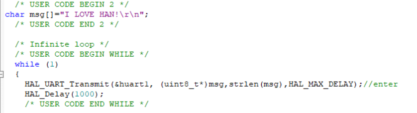
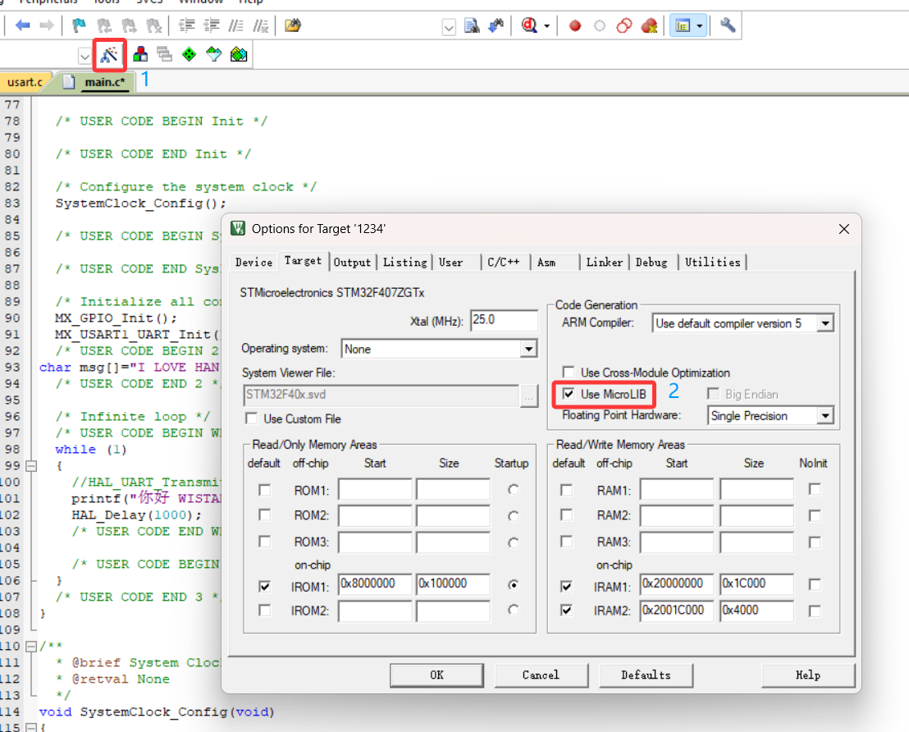
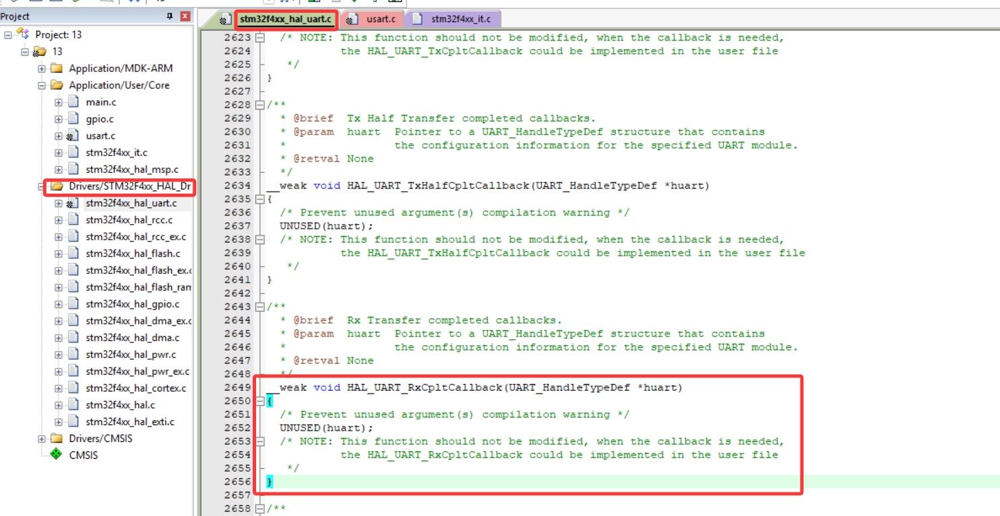

### 1.printf重定向（发送）
- C语言中的printf)默认输出到显示器
- 在嵌入式中没有显示器→需要重定向到串口
- 通过重写fputcO函数，把printfO输出的字符通过串口发出去：
>int fputc(int ch, FILE *f)//重定向
{
HAL_UART_Transmit(&huart1,(uint8_t *)&ch, 1, HAL_MAX_DELAY);
return ch;
}//记得加stdio.h
// / * USER CODE BEGIN 4 * /下面

开始
>
/* 记得定义==char msg[]="wcnm!\r\n";==\r回车
和头文件string.h */
同时也可以写printf

>>如果不勾选printf就打印不出。
*** 
### 阻塞发送
阻塞接收、非阻塞接收（轮询）、中断接收、DMA接收。
//用了printf都要记得加int fputc...
#### 1.什么是阻塞接收？
- 调用接收函数后，程序会一直等待数据到来。
- 一旦接收到指定数量的数据或超时，函数才会返回。
- 特点：简单直接、但会“卡住程序”，不适合实时性强的场景。
>uint8_t Buff[2];//存储接收的2个字节
/* USER CODE END 2 */

>printf("\r\n目前处于阻塞接收模式，等待发送\r\n");
HAL_UART_Receive(&huart1,Buff,2,HAL_MAX_DELAY );//未收到一直等待
HAL_UART_Transmit(&huart1,Buff,2,HAL_MAX_DELAY );//回显echo
/* USER CODE END WHILE */
***
#### 2.什么是中断接收？
- 当串口接收到预定数量的数据后（例如1个或4个字节），硬件会自动触发一个中断信号。//来了再通知CPU
- 非阻塞：不会卡住主程序。
- 自动响应：数据一到，立即中断处理。
- 适合定长数据包：可以设置接收固定字节数。
- 回调函数处理：数据到达后，自动调用回调函数处理数据。
- ##### 学习的函数
| 功能 | HAL API | 简要说明 |
| :------: | :------: | :------: |
|启动中断接收|HAL_UART_Receive_IT()|启动接收，指定接收缓冲区和长度|
|发送数据（中断方式）|HAL_UART_Transmit_IT()|使用中断方式发送数据|
|接收完成回调函数|HAL_UART_RxCpltCallback()|接收完成时自动调用，用户可在此处理数据|

>##### **寻找**函数
>
>删去__weak//弱函数
>/* USER CODE BEGIN 4 */
>//请放这里
>/* USER CODE END 4 */

>/* USER CODE BEGIN PD */
#define LENGTH 5//接收缓冲区大小
>/* USER CODE END PD */
>***
>/* USER CODE BEGIN PV */
uint8_t RXbuff[LENGTH];//接收缓冲区
/* USER CODE END PV */
>***
>while (1)
  {
		HAL_UART_Receive_IT(&huart1,RXbuff,LENGTH);//使能接收中断，只执行一次
    /* USER CODE BEGIN 3 */
  }
>***
  >void HAL_UART_RxCpltCallback(UART_HandleTypeDef *huart)
{
 if(huart -> Instance==USART1)//指向存放基址的变量（基址），判断发生接收中断的串口
 {
	 printf("\r\n开启接收中断\r\n");
	 HAL_UART_Transmit_IT(&huart1,RXbuff,LENGTH);//回显发送数据
	 	HAL_UART_Receive_IT(&huart1,RXbuff,LENGTH);//使能接收中断,继续
}