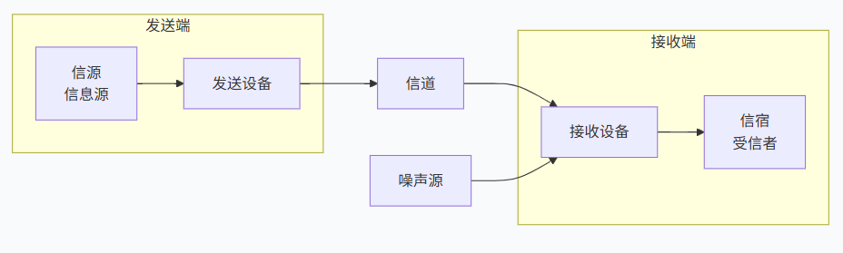
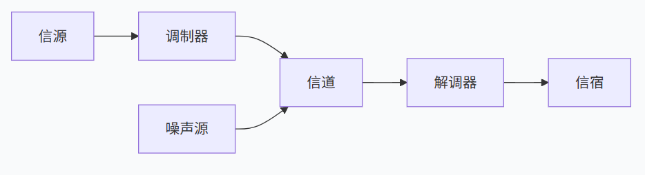
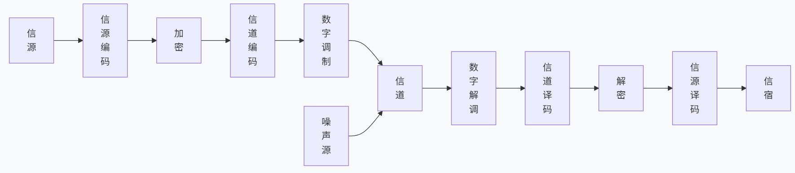

## 1.基本概念
- 目的：传递消息中包含的信息。
  >消息：传递的对象，信息的载体（文字，语音，符号，数据）
  >信息：消息中的有效内容。
- 信号（消息传递的载体）
  >模拟信号:**自然，连续**。
  >数字信号:**人造，离散**。
  >博客网址：https://blog.csdn.net/weixin_48100941/article/details/126499511?ops_request_misc=elastic_search_misc&request_id=573df799141a6f938793f47d87074e5d&biz_id=0&utm_medium=distribute.pc_search_result.none-task-blog-2~all~top_positive~default-1-126499511-null-null.142^v102^pc_search_result_base6&utm_term=%E6%A8%A1%E6%8B%9F%E4%BF%A1%E5%8F%B7%E5%92%8C%E6%95%B0%E5%AD%97%E4%BF%A1%E5%8F%B7&spm=1018.2226.3001.4187

## 2.通信系统模型
#### 1.一般模型

>1.信息源：消息转化成原始电信号（高低电平）。
>2.发射设备：产生适合于在信道中传输的信号。（编码和加密）
>3.信道：是一种物理媒质。包过有线信道和无线信道。
>4.噪声源：通信系统中各处噪声的集中表示。
>5.接收设备：解调（解码和解密），恢复原始电信号。
>6.受信者：把原始电信号还原。

#### 2.模拟通信系统模型
> 定义：利用模拟信号来传递消息的通信系统。

##### 重要变化
* ==仅变换==**通常指的是调制或解调这一核心操作，特指仅对信号的表示形式进行改变，而不涉及其他复杂处理（如编码、加密、放大等）。**
* 消息转化为==基带信号==。仅变换由信源和信宿来完成。
* 基带信号转化为==已调信号==。仅变换通常是调制器，解调器完成。

#### 3.数字通信系统模型
> 定义:利用数字信号来传递信息的通信系统。

>- 信源编码的俩个基本功能：提高信息传递有效性（压缩编码，减少冗余）,模/数转换（A/D）。
>+ 信道编码的功能：进行**差错控制编码**，提高可靠性（降低误码率）。
>>==差错控制编码==，也常被称为信道编码，是一种在数字通信系统中，为了对抗信道中噪声和干扰的影响，降低传输误码率而引入的信号处理技术。
>- 加密解密：提高信息的安全。
>- 数字调制：形成适合在信道中传输的**带通信号**。
>>==带通信号==，简单来说，就是频谱集中在某个中心频率附近、不包含零频（直流）分量的信号。它是在通信系统中经过调制后，适合在无线信道或有线信道（如电话线）中传输的信号形态。
>- 同步：使收/发端的信号在时间上保持步调一致。(前提条件)